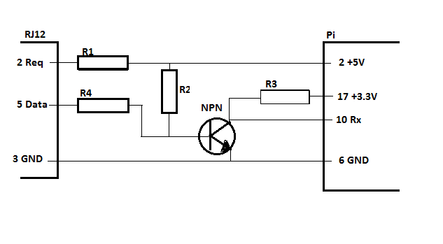

# aidon6534_via_pi_to_ha
HW description and SW(python, yaml, instructions) to get my Aidon 6534 electrical meter from "Tekniska verken" using P1 interface to work with my homeassistant.
Make sure you have a 6 pins RJ12 connection. There are other variants of Aidon6534 with a complete differnt interface with RJ45 connection (Norwegian interface)

## HW overview
Aidon6534 -> serial interface -> pi -> mqtt -> ha

# HW needed
* Aidon 6534 (As you found this, you most probably have one
* pi (I use an old 1B with 2 GB SD card)
* An half RJ12 cable (I bought from Kjell o Company) (max length 1,5 meters according to Aidon spec)
* NPN transistor, some resistors
* Board for the electronics
* See below for drawing

## Install
* Aidon. Ask "Tekniska verken" to open the HAN port. (for me it took < 1 day via support)
* Build your serial interface, see drawing below.
* Burn Raspberry Pi Lite to your SD card: https://downloads.raspberrypi.org/raspios_lite_armhf_latest
* Insert card in PI and connect to network (I use Putty and ssh, Google instructions for logging in to Pi)
* Connect the R12 to the HAN port
* In Pi:
  * Download the file serial2mqtt.py
  * Copy secret_template.py to secret.py and modify content with your local passwords etcetera
  * pip3 install paho-mqtt
  * sudo python3 serial2mqtt.py
* On HA, install the Mosquitto MQTT broker https://www.home-assistant.io/docs/mqtt/broker/
* In your configuration.yaml, add code like:
```yaml
sensor:
      - platform: mqtt
        state_topic: "active_import_energy"
        name: "Energi Imp"
        unit_of_measurement: "kWh"
      - platform: mqtt
        state_topic: "active_export_energy"
        name: "Energi Exp"
        unit_of_measurement: "kWh"
      - platform: mqtt
        state_topic: "active_import_power"
        name: "Effekt Imp"
        unit_of_measurement: "W"
      - platform: mqtt 
        state_topic: "active_export_power"
        name: "Effekt Exp"
        unit_of_measurement: "W"
      - platform: mqtt
        state_topic: "phase_voltage_L1"
        name: "U_1"
        unit_of_measurement: "V"
```

## HW
* R1 100 ohm
* R2 10 kOhm
* R3 10 kOhm
* R4 100 ohm


## Things i have learned
Could also be called "mistakes done", or kindness to my future self
* Wrong BAUD will also provide data, but then you shall not expect to have the full data.
* parsing the HAN interface is not as complicated as you first thought. This information seems to be enough:
* Each row has the following format: < something1 >< obiscode >< 1byte >< data >< something2 >, where:
  *   < something1 > is what it says.
  *   < obiscode > is the 5-byte code you can find in different specifications, e.g. 0.1.7.0.255 means "momentary active power". It always seems to end with 255. I used that fact and started to understand.
  *   < 1byte > took some time before I realized that the data did not follow right after < obiscode >. < 1byte > seems to be 6 or 12 in my examples.
  *   < data > Format varies for different obis codes. It is explained in https://www.energiforetagen.se/globalassets/medlemsportalen-oppet/branschrekommendation-lokalt-granssnitt-v1_3.pdf?v=fFJaQd1HAO6_cV_CtNnN6RJ66Js
   < something2 > is again to me what it says.

    
* Aidon 6534 has different HAN flavours. Mine is 6442SE, and has a RJ12 connector. I found a description for Norwegian interface before I was aware of that, and bough an MBUS interface. THAT WAS THE WRONG INTERFACE for the "Tekniska Veken" variant I had.
* Data request pin needs current, and using a too big resistor as R1 will not give any data request signal.
* Printing a bytes string in python varies format dependent on if you print many or one element. There are three different printouts used:
  * raw hex value (used in strings), e.g. key = b'\x00\x01\x08\x00\xff'
  * when printing, known ascii codes are shown as ascii also for a b'' string.
  * key[4] shows the decimal value of the byte. In this example 255
  * And learning: it is easy to mixup decimal and hexadecimal when the spec is different from your code.
* mqtt port 1883 worked. 1884 did not. I have not investigated why.
* I guess I can move my home assistant and use the serial interface right away. I have not yet tried.

## How the code works
* serial is read every 5:th second
* when the data seems reasonable, I look for 255 and fill an array with data blocks that ends with 255.
* I use another array (aidon_map) as a parser and look up the obis codes.
* When correct obis code is matched, the data is simple on the next row, second byte and forward (as I ended at 255)
* Data is swapped to a readable value based on the format found in the spec
* The data is sent using mqtt


